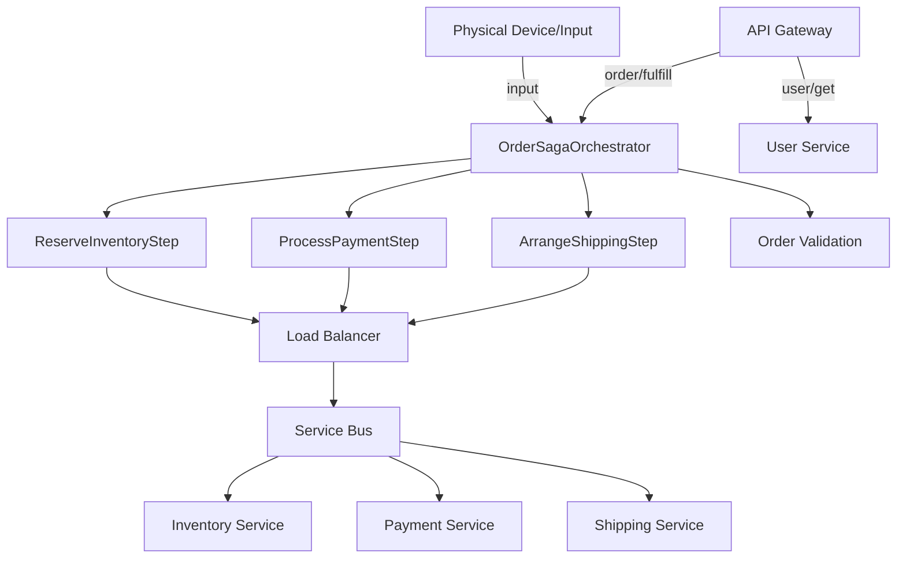

# Architecture Diagram

**Legend:**
- **Physical Device/Input**: Represents a real-world event (e.g., barcode scan, IoT sensor) that can trigger a workflow.
- **API Gateway** routes requests to the saga orchestrator or user service.
- **OrderSagaOrchestrator** coordinates the workflow, validation, and steps.
- **Steps** use the balancer and service bus to interact with domain services.
- **Balancer** and **Service Bus** are infrastructure, routing requests to the correct service instance.
- **Domain services** (Inventory, Payment, Shipping, User) are the business logic endpoints. 